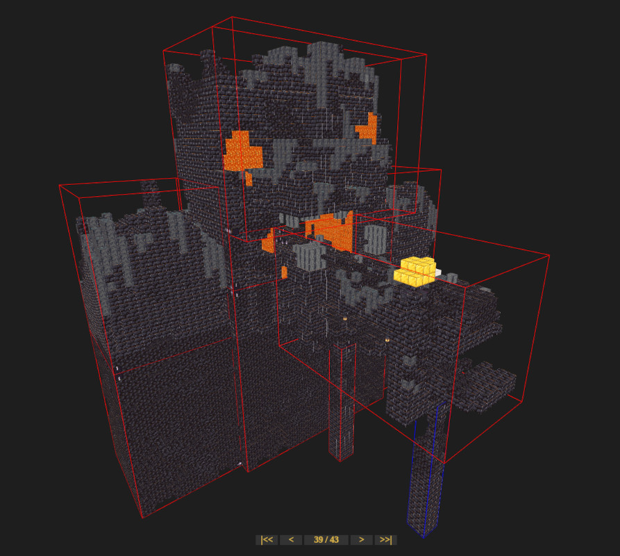

# Minecraft Jigsaw Preview

This tool lets you preview and debug minecraft jigsaw structures.

## Usage
1. If necessary switch rendering mode to ```snapshot``` mode in ```View -> Randering```
2. Open a configured structure feature file of type ```minecraft:village```, ```minecraft:pillager_outpost``` or ```minecraft:bastion_remnant```. This file needs to be in a propper datapack folder structure and all relevant ```template_pool```s and ```structures``` (```.nbt``` file) have to be present.
3.  (Be patient, generation takes a few seconds, no loading bar is shown yet)
4. Use the arrow buttons on the bottom or the left/right arrow keys to to step through the generation process. 

## Downloads
see [Releases](https://github.com/jacobsjo/minecraft-jigsaw-preview/releases)

## Change log
### 0.1.0
- Initial Release

## Bounding Boxes
- Blue: Currently generated structure
- Green: Generating inside of this structure
- Red: Other structures that can't intersect

Note that "inside" is defined loosly in y axis for villages.

